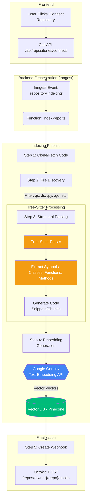
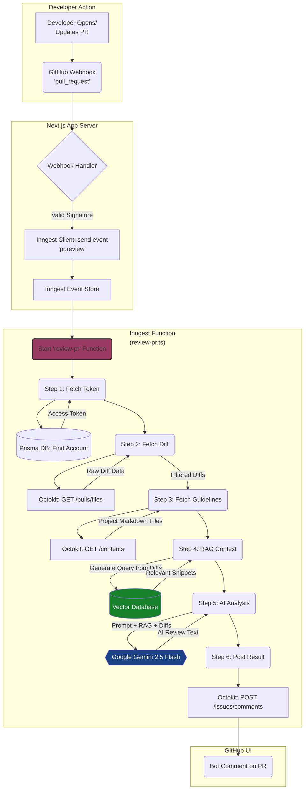
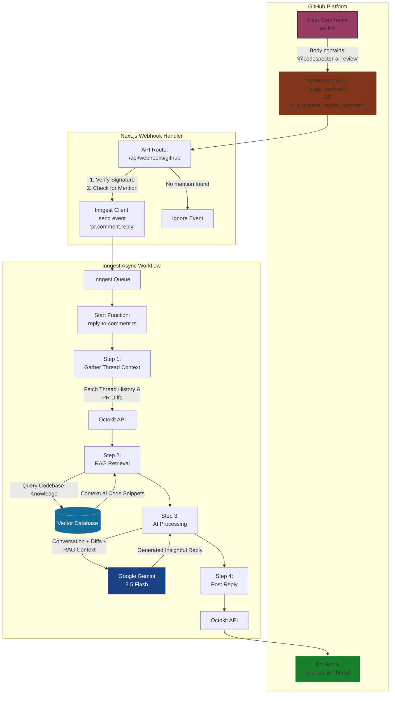

# CodeSpecter: AI-Powered Automated Pull Request Reviewer

[](https://nextjs.org)

**CodeSpecter** is an intelligent automation bot that provides instant, contextual feedback on GitHub Pull Requests. It leverages Google's **Gemini 2.5 Flash**, Retrieval-Augmented Generation (**RAG**) for codebase context, and your project's own guidelines to ensure every PR meets high-quality standards.

Built with **Next.js** and **Inngest** for reliable, multi-step background processing.

---

## ✨ Features

* **Instant Automated Reviews:** Triggers the moment a PR is opened or new code is pushed.
* **Context-Aware (RAG):** Uses a Vector Database to "remember" your codebase, ensuring the AI understands how your specific system works.
* **Guideline Enforcement:** Reads your specific `guidelines/` folder to ensure code follows your team's unique rules.
* **Durable Execution:** Built with Inngest to handle API rate limits and retries automatically.
* **Smart Filtering:** Intelligent diff analysis that ignores lock files, assets, and minified code to focus on logic.

---

## 🏗 Repository Connection & Indexing Flow
This flow illustrates how CodeSpecter processes a repository from the initial click to a fully indexed RAG (Retrieval-Augmented Generation) state.


---

## 🔄 Architecture Flow

This diagram illustrates how a GitHub event travels through the system to generate an AI review.


---

## 💬 Interactive Comment Flow
CodeSpecter can respond interactively when explicitly mentioned in a PR comment
(e.g. @codespecter-ai-review handle this).



---

## ⚙️ Configuration

CodeSpecter is fully customizable. You can control the AI's behavior, tone, and strictness by adding a configuration file to your repository.
### File Location
Create a file named `CODESPECTER.yml` in one of the following locations:
- Root Directory: `./CODESPECTER.yml`
- GitHub Folder: `./.github/CODESPECTER.yml`

### Configuration Schema
The configuration follows this structure:

```typescript
export interface CodeSpecterConfig {
  review?: {
    enabled?: boolean;
    tone?: 'professional' | 'friendly' | 'critical' | 'instructional';
    rules?: string[];   // Strict rules the AI must enforce
    ignore?: string[];  // Glob patterns for files to skip
    guidelines?: string[];  // file/folder paths of guidelines to be followed by the contributor
  };
  chat?: {
    enabled?: boolean;
    persona?: string;       // Custom persona (e.g., "Security Expert")
    instructions?: string[]; // specific guidelines for chat replies
  };
}
```

### Example `CODESPECTER.yml`
Here is a sample configuration you can copy to get started:
```yml
version: 1.0

review:
    enabled: true
    tone: "professional"

    # High Priority Rules (The AI must obey these above all else)
    rules:
        - "STRICT: Do not use `console.log` in production code."
        - "STRICT: All database queries must use the Prisma singleton."
        - "Prefer functional programming patterns over loops where possible."
    
    # Files to ignore during review
    ignore:
        - "db/migrations/*"
        - "**/*.test.ts"
        - "dist/**"

   guidelines:
        - "docs/architecture/BIGGER_PICTURE.md"  # Specific file
        - "team-standards/"                        # Entire folder (reads all .md files inside)
        - "CONTRIBUTING.md"

chat:
    enabled: true
    persona: "Principal Software Architect"
    
    # Instructions for replying to user comments
    instructions:
        - "When asked for code, provide only the snippet and a brief explanation."
        - "Assume the user is using PostgreSQL and TypeScript."
```

---

## 🛠 Tech Stack
- Framework: Next.js (App Router)
- Orchestration: Inngest
- AI Engine: Google Gemini 2.5 Flash (via Vercel AI SDK)
- Database: Prisma + PostgreSQL
- Communication: Octokit 
- Styling: Tailwind CSS, ShadCN UI

## ✅ Prerequisites

### 1. GitHub OAuth
- **GitHub OAuth Application**: Create an OAuth App under your GitHub Developer Settings.
- Set the Authorization callback URL to `${YOUR_APP_URL}/api/auth/callback/github`.
- **Scopes (Permissions)**:  CodeSpecter requests permissions dynamically. Ensure your integration includes the following scopes: `repo`: Grants access to read code and write comments on private/public repositories. `write:repo_hook`: Required to automatically create webhooks for PR tracking.

---

### 2. Google AI Studio
- Generate an **API key** for **Gemini 2.5 Flash**

---

### 3. Inngest
- Install and run the **Inngest Dev Server** for local development

---

## 🚀 Getting Started

### Clone the Repository
```bash
git clone https://github.com/AkshitGarg24/CodeSpecter.git
cd CodeSpecter
```

### Install Dependencies
```bash
bun install
```

### Initialize the Database
```bash
bun x prisma db push
```

### Run Inngest Locally
In a separate terminal:
```bash
npx --ignore-scripts=false inngest-cli@1.14.0 dev
```

### Start the Development Server
```bash
bun run dev
```

## 🔑 Environment Variables
Create a .env file at the project root:
```env
DATABASE_URL=
BETTER_AUTH_SECRET=
BETTER_AUTH_URL=
GITHUB_CLIENT_ID=
GITHUB_CLIENT_SECRET=
WEBHOOK_SECRET=
NEXT_PUBLIC_APP_URL=
PINECONE_DB_API_KEY=
GOOGLE_GENERATIVE_AI_API_KEY=
```
---

## 👨‍💻 Author

Built by **Akshit Garg** 🚀
